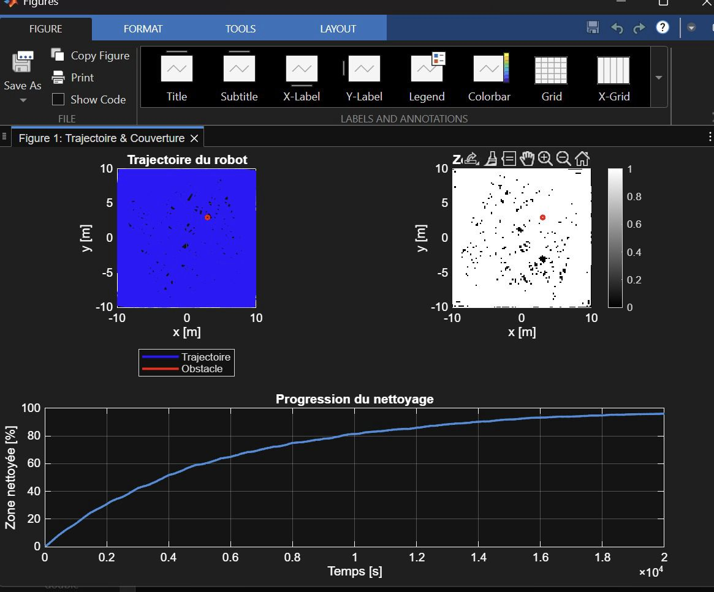

# Mobile Robot Vacuum Simulation


## Description

This project simulates a mobile robot performing autonomous cleaning in a 2D environment using MATLAB and Simulink.

The robot navigates inside a square room, avoids obstacles, and follows a coverage strategy to maximize the cleaned area over time. The simulation evaluates performance using coverage metrics.

## Features

- Differential drive robot model  
- Wall-following and obstacle avoidance behavior  
- Configurable environment and robot parameters  
- Coverage estimation using grid-based mapping  
- Visualization of trajectory and cleaned area  
- Coverage percentage over time  

## Project Structure

- `init_mobile_robotics.m`  
  Initializes all simulation parameters  

- `run_test.m`  
  Runs the simulation and computes performance metrics  

- `vacuum_cleaner.slx`  
  Simulink model of the robot  

## Results



## Simulation Parameters

- Room size: 20 x 20 meters  
- Wheel radius: 0.05 m  
- Robot width: 0.30 m  
- Maximum speed: 0.30 m/s  
- Sampling time: 0.05 s  

Obstacle:
- Position: (3, 3)  
- Radius: 0.25 m  

## Usage

1. Open MATLAB  
2. Navigate to the project folder  
3. Run:
   ```matlab
   init_mobile_robotics
